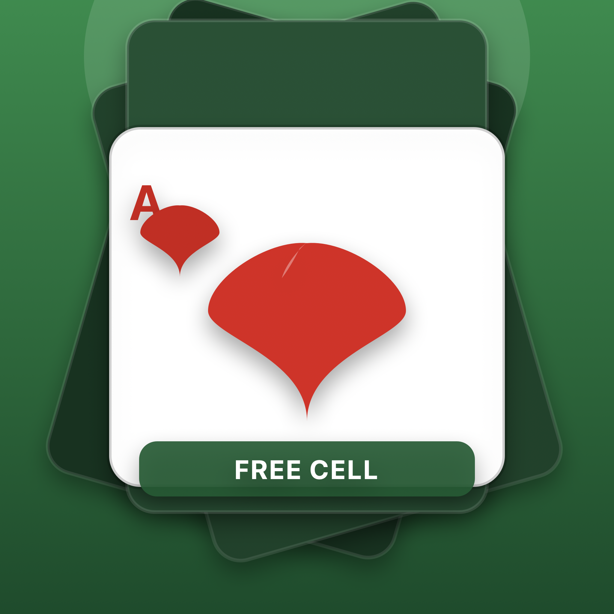
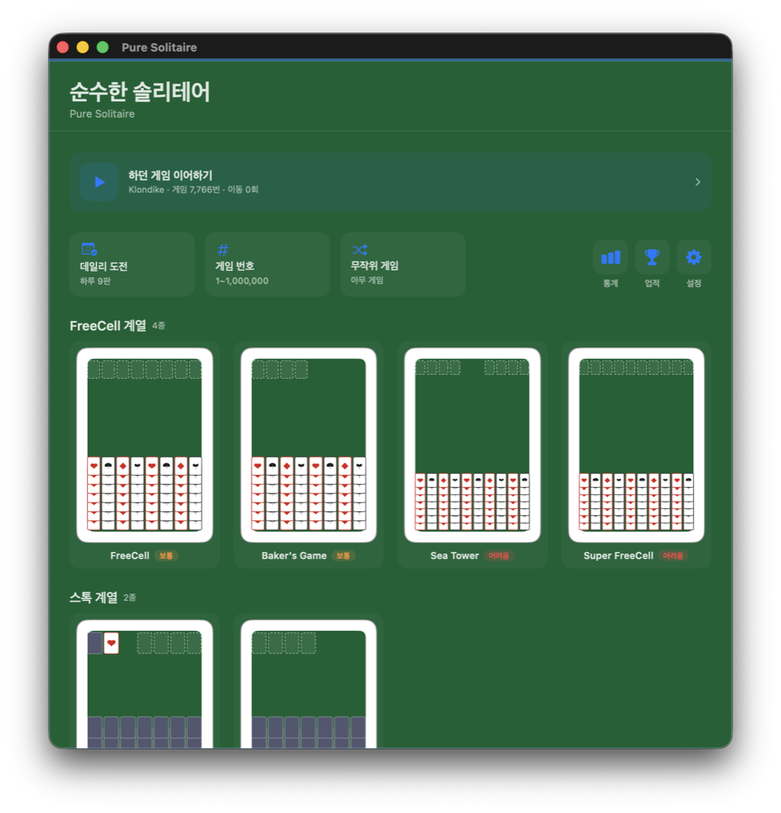
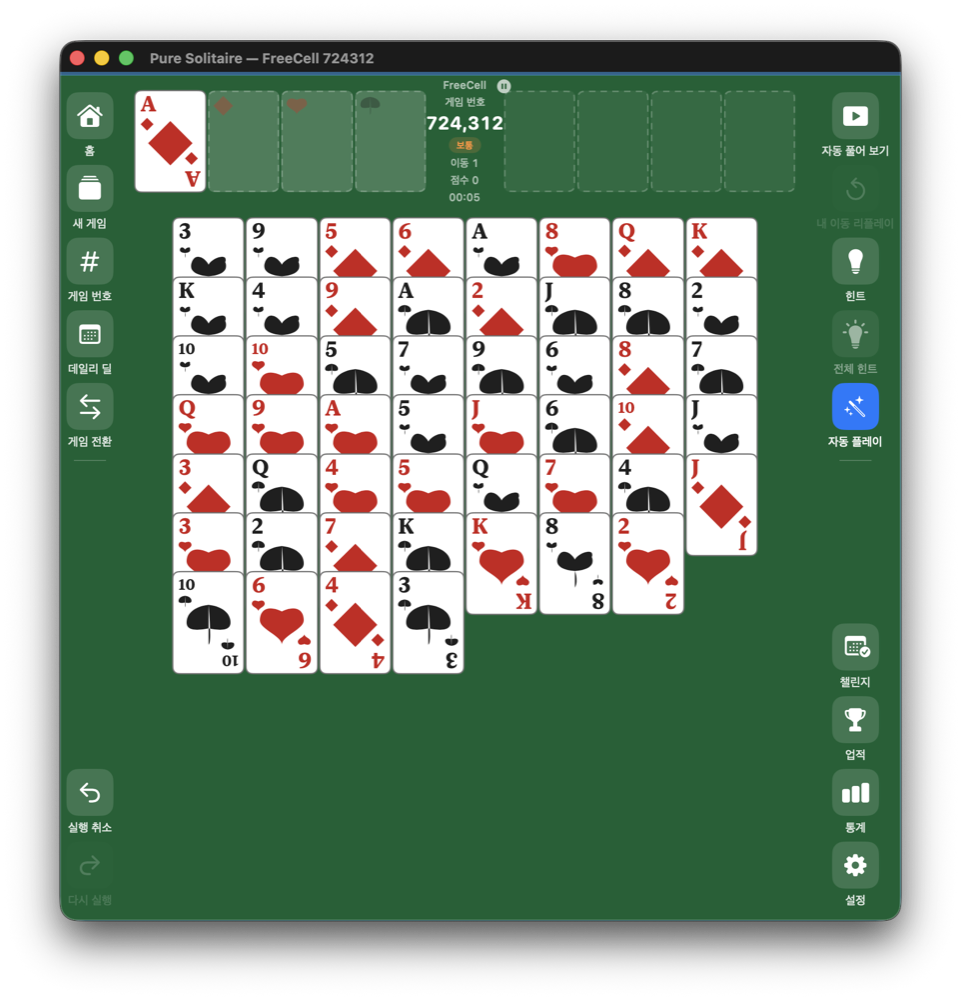

<p align="center">
  
</p>

<h1 align="center">Pure Solitaire</h1>

<p align="center">
  A no-frills collection of classic card games, reborn for Mac.<br>
  No ads. No sign-ins. Just clean, authentic Microsoft rules.
</p>

<p align="center">
  <strong>Native macOS</strong> · <strong>Swift 6 + SwiftUI</strong> · <strong>12 game variants</strong>
</p>

<p align="center">
  <a href="https://github.com/BoraSarang/Pure-Solitaire/releases"></a>
  <a href="https://github.com/BoraSarang/Pure-Solitaire/actions/workflows/release.yml"></a>
  <a href="https://github.com/BoraSarang/Pure-Solitaire"></a>
</p>

<p align="center">
  ✦ Author <a href="https://github.com/BoraSarang">BoRaSaRang</a> &nbsp;·&nbsp;
  ✉️ Contact <a href="mailto:leeborasarang@gmail.com">leeborasarang@gmail.com</a>
</p>

---

## 🖼️ Preview

<p align="center">
  
</p>
<p align="center">
  
</p>

## 🎮 Supported Games (12)

| Game | Highlights |
|------|------------|
| **FreeCell** | Authentic Microsoft rules — 8 columns + 4 free cells + 4 home cells, supermove |
| **Baker's Game** | Pure free cell — same-suit builds only, no free cells |
| **Klondike** | Stock · waste · 7 columns, alternating colors, stock recycle (1 or 3 cards) |
| **Spider** | 10 columns + 5 stock piles, same-suit K→A (4 difficulty levels) |
| **Sea Tower** | 10 columns × 5 cards + 2 free cells, same suit, K only on empty columns |
| **Super FreeCell** | 2 decks (104 cards) + 6 free cells, 26 cards per home suit |
| **Yukon** | Move any face-up card with all cards above it as a group |
| **Forty Thieves** | 2 decks, 10 columns × 4 cards all face up, 8 home cells |
| **Golf** | 7 columns all face up, waste ±1 rank / same rank removal |
| **Pyramid** | 28-card pyramid, exposed pairs summing to 13 removed, one-time stock recycle |
| **TriPeaks** | 3 peaks, waste ±1 rank removal |
| **Scorpion** | 7 columns × 7 cards + 3 reserve, group movement, K only on empty columns |

## ✨ Key Features

- **Home Screen**: App opens to a game-selection screen — 4 category groups (FreeCell / Stock & Waste / Spider / Removal) sorted by difficulty within each group, plus a "Resume" card for your current game
- **Numbered Deals**: Reproduce Microsoft's exact card layout using game numbers 1–1,000,000 (verified against MS deals #1/#617)
- **Winnable Deals**: Unsolvable FreeCell numbers are skipped; the game auto-starts from a solvable number (built-in solver)
- **Auto Solve ⇧⌘P**: Built-in DFS solver finds a winning path and replays it automatically (progress bar, 3 speed levels, pause/resume, restores state after demo)
- **Replay My Moves ⇧⌘R**: Rewatch your winning game from the first move onward, exactly as you played it
- **Game Mode**: Switch between Standard (4 games: FreeCell, Klondike, Spider, Pyramid) and Extended (all 12) in Settings — Home · number sheet · random switch · today's deal show only the variants in the current mode; games in progress survive a mode switch
- **Daily Challenge**: Mode-based deal count (Standard 4 / Extended 9) with a date seed, 3-month calendar with ★ completion, star rating (win · time · moves), monthly stats & badges (Bronze / Silver / Gold / Diamond), per-deal difficulty tags
- **10 Achievements**: From first win to 50 wins, 5-game streaks, variant completions, and 3-star challenges
- **Scoring**: Standard game-specific scoring per move, win bonus, final score in stats
- **Intuitive Controls**: Drag & drop, click to move, double-click to auto-send home
- **Unlimited Undo / Redo**: Snapshot-based — crash-safe infinite undo/redo
- **Auto-Play**: Safely moves eligible cards (Aces, etc.) to home cells
- **Hints**: Shows best available move + full hint (highlights all valid moves) + drag-path animation
- **Victory Celebration**: Confetti particles + sound sequence + banner
- **Stats & Records**: Per-game statistics, fastest wins, recent win history (auto-saved)
- **Customization**: Card styles (Classic / Simple / Retro / Deep) · card back patterns (5 options) · background color · custom photo upload · board zoom · BGM & sound volume
- **Accessibility**: VoiceOver card hints/values, black text on white backgrounds

## ⌨️ Keyboard Shortcuts

| Shortcut | Action |
|----------|--------|
| `⌘1` | Home screen |
| `⌘N` | New game |
| `⌘G` | Game number selection |
| `⌘D` | Daily deal |
| `⌥⌘D` | Daily challenge |
| `⇧⌘P` | Auto solve |
| `⇧⌘R` | Replay my moves |
| `⌥⌘T` | Achievements |
| `⌘Z` / `⇧⌘Z` | Undo / Redo |
| `⌘H` / `⇧⌘H` | Hint / Full hint |
| `⏎` | Apply hint |
| `⇧⌘A` | Auto-play |
| `⌘T` | Statistics |
| `⌘,` | Settings |
| `⌘+` / `⌘-` | Board zoom |

## 🔧 System Requirements

- macOS 13 or later (developed and verified on macOS 26, arm64)
- No additional dependencies — runs as a standalone app

## 🚀 Installation

Download the latest `.app` bundle from [GitHub Releases](https://github.com/BoraSarang/Pure-Solitaire/releases), or build from source:

```bash
# Build & test
swift build -c release
swift test -c release

# Install .app to ~/Applications and launch
./scripts/build_and_run.sh release
```

> App name: **Pure Solitaire.app** — displayed as **"Pure Solitaire"** in the Dock.

## 🛠️ Tech Stack

- **Swift 6 + SwiftUI**, Swift Package Manager (no Xcode project needed)
- 2 targets: `GameCore` (platform-independent rules & logic, unit tests) + `PureSolitaire` (SwiftUI app)
- Persistence: UserDefaults (settings, statistics, saved games)
- Microsoft deal algorithm: LCG `state = (state × 214013 + 2531011) mod 2³¹`, `rand = state >> 16`

## 🧪 Tests

- **274 unit tests** passing (deal reproduction · move rules · supermove capacity · win detection · save/restore · daily challenge/challenge store/achievements · Winnable solver · auto solve · difficulty rating · category/difficulty display · game modes · Pyramid recycle)

```bash
swift test -c release
```

## 📄 Documentation

- [PRD — Product Requirements](docs/PRD.md)
- [DESIGN — Technical Design](docs/DESIGN.md)
- [CHANGELOG](docs/CHANGELOG.md)

## ⚖️ License

© 2026 Pure Solitaire — All rights reserved.

## 🙌 Author

- **Author**: [BoRaSaRang](https://github.com/BoraSarang)
- **Email**: [leeborasarang@gmail.com](mailto:leeborasarang@gmail.com)
- Bug reports, feature requests, and feedback are always welcome.
