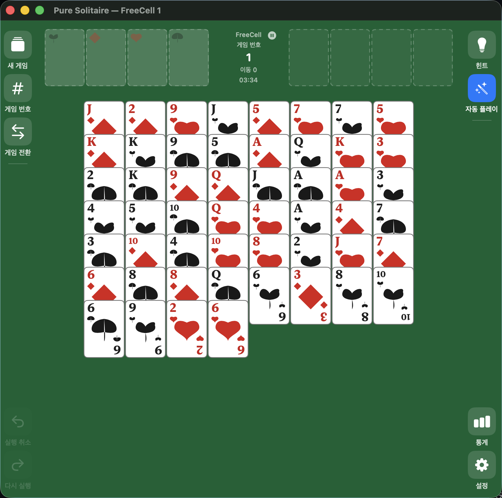

<p align="center">
  
</p>

<h1 align="center">Pure Solitaire · 순수한 솔리테어</h1>

<p align="center">
  맥을 위해 재탄생한 군더더기 없는 클래식 카드 게임 모음.<br>
  광고 없이, 로그인 없이, 깔끔하게 — 마이크로소프트 정통 규칙 그대로.
</p>

<p align="center">
  <strong>macOS 네이티브</strong> · <strong>Swift 6 + SwiftUI</strong> · <strong>11가지 게임 형식</strong>
</p>

---

## 🖼️ 미리보기

<p align="center">
  
</p>

## 🎮 지원 게임 (11종)

| 게임 | 특징 |
|------|------|
| **FreeCell** | 마이크로소프트 정통 규칙, 8열 + 프리셀 4 + 홈셀 4, 수퍼무브 |
| **Baker's Game** | 프리셀 없이 같은 수트로만 정리하는 순수 프리셀 |
| **Klondike** | 스톡·웨이스트 + 7열, 교대색, 뒤집힌 카드, 스톡 재활용 |
| **Spider** | 10열 + 스톡 5더미, 같은 수트 K→A 완성 (4가지 난이도) |
| **Sea Tower** | 10열×5장 + 프리셀 2장, 같은 수트, 빈 열엔 K만 |
| **Super FreeCell** | 2덱 104장 + 프리셀 6, 홈셀 수트당 26장 |
| **Yukon** | 앞면 카드와 그 위 전체를 그룹으로 자유 이동 |
| **Forty Thieves** | 2덱, 10열×4장 전부 앞면, 홈셀 8개 |
| **Golf** | 7열 전부 앞면, 웨이스트와 1 차이/같은 랭크 카드 제거 |
| **Pyramid** | 피라미드 28장, 합 13인 노출 카드 제거 |
| **TriPeaks** | 3개 봉우리, 웨이스트와 1 랭크 차이 제거 |

## ✨ 주요 기능

- **게임 번호 기반 딜**: 1 ~ 1,000,000 사이 게임 번호로 마이크로소프트와 동일한 배치 재현 (검증: 게임 #1/#617)
- **직관적인 조작**: 드래그 & 드롭, 클릭 이동, 더블클릭 홈 자동 이동
- **무제한 실행 취소 / 다시 실행** + 상태 스냅샷 기반이라 크래시에 안전
- **자동 플레이**: 안전한 카드(에이스 등)를 홈셀로 자동 이동
- **힌트**: 이동 가능한 최적 후보를 표시 + 드래그 경로 애니메이션
- **승리 연출**: 파티클(컨페티) + 사운드 시퀀스 + 배너
- **통계 & 기록**: 게임별 통계·최단 승리·최근 승리 기록 (자동 저장)
- **설정**: 카드 스타일(클래식/심플) · 카드 뒷면 패턴 · 배경색 · 보드 줌 · BGM/효과음 볼륨
- **접근성**: VoiceOver 카드 힌트/값 제공, 화이트 배경 대응 검정 텍스트

## ⌨️ 단축키

| 단축키 | 동작 |
|--------|------|
| `⌘N` | 새 게임 |
| `⇧⌘N` | 게임 번호 선택 |
| `⌘Z` / `⇧⌘Z` | 실행 취소 / 다시 실행 |
| `⌘H` | 힌트 |
| `⇧⌘A` | 자동 플레이 |
| `⌘+` / `⌘-` | 보드 줌 |

## 🔧 시스템 요구 사항

- macOS 13 이상 (macOS 26, arm64에서 개발·검증)
- 기타 추가 설치 없음 — 로컬 실행 독립 앱

## 🚀 설치

GitHub Releases에서 최신 `.app` 번들을 받거나, 소스에서 직접 빌드:

```bash
# 빌드 · 테스트
swift build -c release
swift test

# .app 번들을 ~/Applications 에 설치하고 실행
./scripts/build_and_run.sh release
```

> 앱 이름: **Pure Solitaire.app** — Dock에서는 **"순수한 솔리테어"**로 표시됩니다.

## 🛠️ 기술 스택

- **Swift 6 + SwiftUI**, Swift Package Manager (Xcode 프로젝트 불필요)
- 2개 타깃: `GameCore`(플랫폼 독립 규칙 로직, 단위 테스트) + `PureSolitaire`(SwiftUI 앱)
- 지속 저장: UserDefaults (설정·통계·저장 게임)
- 마이크로소프트 딜 알고리즘: LCG `state = (state×214013 + 2531011) mod 2³¹`, `rand = state >> 16`

## 🧪 테스트

- 단위 테스트 171개 통과 (딜 재현 · 이동 규칙 · 수퍼무브 용량 · 승리 판정 · 저장/복원)

```bash
swift test
```

## 📄 문서

- [PRD — 제품 요구사항](docs/PRD.md)
- [DESIGN — 기술 설계](docs/DESIGN.md)
- [변경 이력 (CHANGELOG)](docs/CHANGELOG.md)

## ⚖️ 라이선스

© 2026 Pure Solitaire — 모든 권리 보유.